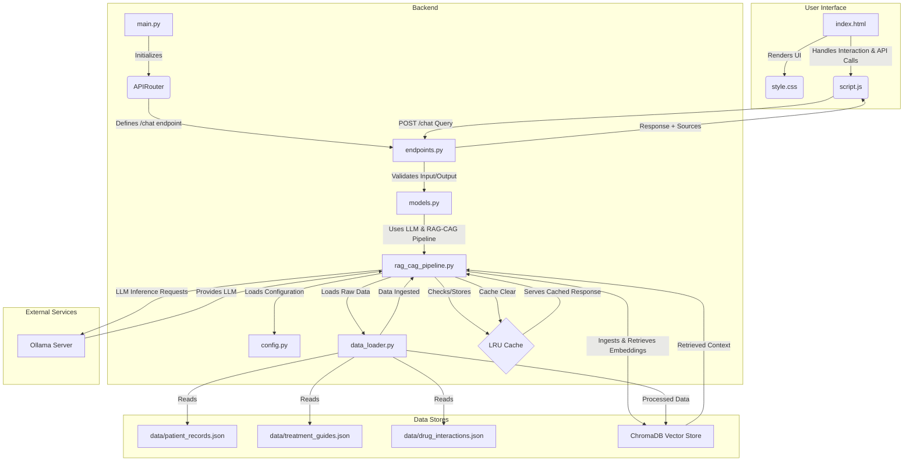

# AI Augmented Healthcare Assistant
## Architecture

## Features
### Core AI & Backend
- Retrieval Augmented Generation (RAG): Integrates an LLM with a knowledge base to generate informed responses.
- Content Augmented Generation (CAG): Utilizes an LRU cache to store and serve previous responses, augmenting the generation process by providing faster retrieval for repeated queries.
- Ollama LLM Integration: Utilizes a locally or self-hosted LLM (mistral) for natural language understanding and generation.
- HuggingFace Embeddings: Transforms textual data into vector embeddings, serving as the application's searchable knowledge base.
- Intelligent Data Ingestion: Automatically loads and processes raw JSON data (patient records, treatment guides, drug interactions) into the ChromaDB upon startup, only, if the database is not already populated.
- Structured Data Handling: Specifically processes and stores patient records, comprehensive treatment guides, and detailed drug interaction information.
- API Endpoint (`/chat`): Provides a RESTful interface for external applications (like your frontend) to send natural language queries.
- Input/Output Validation: Uses Pydantic models to ensure the structure and type correctness of API requests and responses.
- Ollama Connection & Model Check: Verifies that the Ollama server is running and the specified LLM model is available during application startup.
- FastAPI Framework: Provides a robust, modern, and performant backend API.
- CORS Support: Configured to allow cross-origin requests, enabling seamless frontend-backend communication.
- Static File Serving: Capable of serving static frontend assets (HTML, CSS, JavaScript).

### UI & Frontend
- Two-Panel Layout: A clear and intuitive user interface with a dedicated chat area and a separate panel for displaying source documents.
- Interactive Chat Interface: Allows users to type and submit natural language questions to the AI assistant.
- Dynamic Message Display: Real-time rendering of both user queries and AI-generated responses within the chat box.
- Source Document Transparency: Displays snippets of the exact source documents (patient records, treatment guides, drug interactions) that the AI used to formulate its response, including relevant metadata (e.g., source type, patient ID, condition, drug names).
- Loading Indicator: Provides visual feedback ("Thinking...") to the user while the AI processes a query.
- Frontend Error Handling: Displays user-friendly messages if there's an issue communicating with the backend or processing the request.
- Automatic Chat Scrolling: Ensures the chat view automatically scrolls to the latest message.
- Keyboard Submission: Supports submitting queries by pressing the Enter key in the input field.
- Basic Responsive Design: Uses a flexible layout (flexbox) to adapt to different screen sizes.
