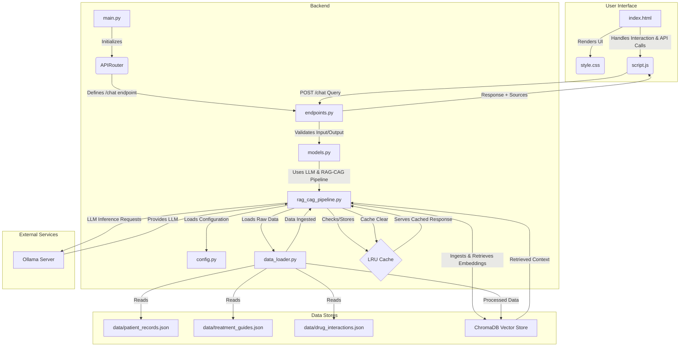

# AI Augmented Healthcare Assistant
## Architecture

```mermaid
graph TD
    subgraph User Interface
        A[index.html]
        B(style.css)
        C(script.js)
        A -- Renders UI --> B
        A -- Handles Interaction & API Calls --> C
    end

    subgraph Backend
        D[main.py]
        E(APIRouter)
        F[endpoints.py]
        G[models.py]
        H[rag_cag_pipeline.py]
        I[config.py]
        J[data_loader.py]
        P{LRU Cache}

        D -- Initializes --> E
        E -- Defines /chat endpoint --> F
        F -- Validates Input/Output --> G
        G -- Uses LLM & RAG-CAG Pipeline --> H
        H -- Loads Configuration --> I
        H -- Loads Raw Data --> J

        H -- Checks/Stores --> P
        P -- Serves Cached Response --> H
        J -- "Data Ingested" --> H
        H -- "Cache Clear" --> P
    end

    subgraph External Services
        K[Ollama Server]
        K -- Provides LLM --> H
    end

    subgraph Data Stores
        L[data/patient_records.json]
        M[data/treatment_guides.json]
        N[data/drug_interactions.json]
        O[ChromaDB Vector Store]

        J -- Reads --> L
        J -- Reads --> M
        J -- Reads --> N
        H -- Ingests & Retrieves Embeddings --> O
    end

    C -- "POST /chat Query" --> F
    F -- "Response + Sources" --> C

    H -- "LLM Inference Requests" --> K
    O -- "Retrieved Context" --> H

    J -- "Processed Data" --> O
```
