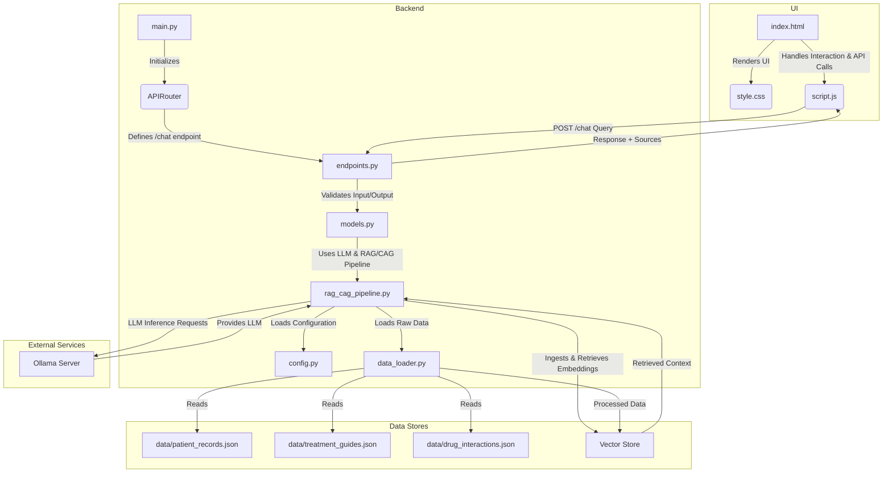

# AI Augmented Healthcare Assistant
## Architecture

## Features
-

## Column Profiles
### `drug_interactions.json`
- `drug1`: Name of the first drug involved in the interaction.
- `drug2`: Name of the second drug involved in the interaction.
- `interaction`: A detailed description of the drug interaction, including risks and management advice.

### `patient_records.json`
- `id`: Unique identifier for the patient record.
- `name`: Patient's full name.
- `age`: Patient's age in years.
- `diagnosis`: The primary medical disgnosis of the patient.
- `medications`: A comma-separated list of medications the patient is currently on.
- `history`: A summary of the patient's medical history relevant to their diagnosis and current state.
- `notes`: Additional notes or specific concerns from the patient's visit.

### `treatment_guides.json`
- `condition`: The medical condition for which the guide provides treatment information.
- `guide`: A comprehensive guide outlining treatment strategies, including lifestyle, pharmacological, and other interventions.